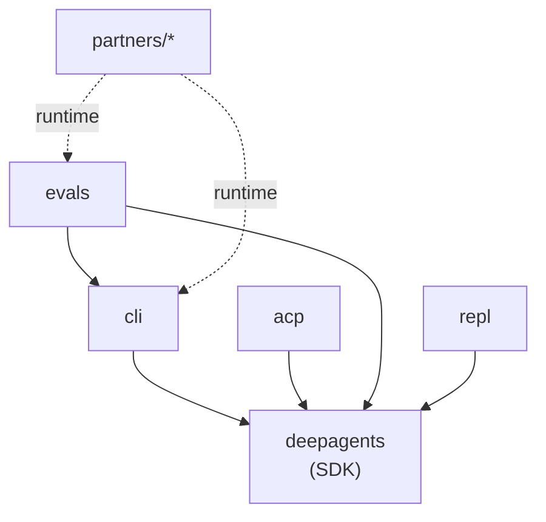
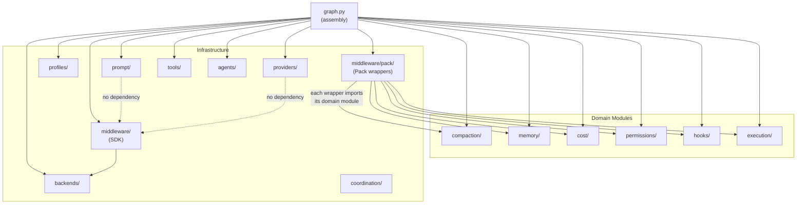

# Pack Architecture

## Monorepo overview

Pack is a monorepo containing an AI agent SDK and its surrounding tooling.

| Package | Path | Purpose |
|---------|------|---------|
| **deepagents** | `libs/deepagents/` | Core SDK. Model resolution, graph assembly, middleware, domain modules, tools. |
| **cli** | `libs/cli/` | Interactive CLI (`deepagents-cli`). System prompt template, agent factory, slash commands, local context. |
| **acp** | `libs/acp/` | Agent Communication Protocol server and demo agents. |
| **evals** | `libs/evals/` | Harbor benchmark runner, LangSmith integration, experiment analysis. |
| **partners** | `libs/partners/` | Sandbox provider integrations (Daytona, Modal, QuickJS, Runloop). |
| **repl** | `libs/repl/` | `langchain-repl` -- interactive REPL for LangChain agents. |

### Package dependency tree

```
deepagents (SDK)
  |
  +-- cli          (imports deepagents, adds CLI chrome)
  +-- acp          (imports deepagents, exposes ACP server)
  +-- evals        (imports deepagents + cli, runs Harbor benchmarks)
  +-- repl         (imports langchain, provides interactive REPL)
  +-- partners/*   (sandbox backends, imported by cli/evals at runtime)
```



---

## SDK modules (`libs/deepagents/deepagents/`)

There are 14 top-level modules plus standalone files (`graph.py`, `_models.py`, `_version.py`).

| # | Module | Role |
|---|--------|------|
| 1 | **agents/** | Pre-configured agent profiles (Explore, Plan, Review, General) with scoped tools and prompts. |
| 2 | **backends/** | Pluggable storage and execution backends: `StateBackend`, `FilesystemBackend`, `LangSmithSandbox`, `LocalShellBackend`, `CompositeBackend`, `StoreBackend`. |
| 3 | **compaction/** | Multi-strategy context compaction (trim, collapse, summarize). `CompactionMonitor` triggers tiers based on token usage; `ContextCollapser` persists originals to disk. |
| 4 | **coordination/** | Multi-agent coordination: fork, teammate (async mailbox), and worktree (git-isolated) execution models. |
| 5 | **cost/** | Dollar-amount cost tracking with per-model pricing tables, session accumulation, budget enforcement, and display formatting. |
| 6 | **execution/** | Parallel tool execution. Independent tool calls (no shared file paths) run concurrently via `asyncio.gather`; dependent calls run sequentially. |
| 7 | **hooks/** | Lifecycle hook engine. Shell commands triggered at tool calls, model calls, session boundaries, file modifications. Async subprocess execution with timeout enforcement and template substitution. |
| 8 | **memory/** | Structured memory with 4-category taxonomy (preferences, corrections, conventions, resources). Three-layer storage: index (always loaded), topic files (on demand), transcripts (grep-only). Includes `DreamConsolidator` for auto-consolidation. |
| 9 | **middleware/** | SDK middleware (upstream): `FilesystemMiddleware`, `SubAgentMiddleware`, `SummarizationMiddleware`, `SkillsMiddleware`, `MemoryMiddleware`, `PatchToolCallsMiddleware`, `_PermissionMiddleware`, `_ToolExclusionMiddleware`. Pack wrappers live in `middleware/pack/`. |
| 10 | **permissions/** | Multi-layer permission pipeline: rule matching, risk assessment, read-only whitelist, classifier. Circuit breaker degrades to manual mode. `RuleStore` persists cross-session rules. |
| 11 | **profiles/** | Harness profiles and provider-specific configuration. Registry of `_HarnessProfile` objects keyed by model/provider string. Profiles control base prompts, excluded tools, description overrides, extra middleware. |
| 12 | **prompt/** | System prompt builder with provider-aware cache boundaries. Modular sections (identity, environment, git, safety, style, tool rules). `CacheStrategy` implementations for Anthropic and OpenAI. |
| 13 | **providers/** | Unified provider interface for model routing. `OpenRouterProvider`, `OllamaProvider`, auxiliary model configs for routing cheap tasks. |
| 14 | **tools/** | Extended tools: git worktree management (`create`, `list`, `remove`) and document readers (`read_pdf`, `read_image`). |

---

## Middleware composition order

`graph.py` is the single assembly point. It builds the middleware stack in `create_deep_agent` (main agent) and `_add_pack_middleware` (Pack harness). The final order, from first to last:

### Main agent stack (`deepagent_middleware`)

1. **HooksMiddleware** -- inserted at position 0 by `_add_pack_middleware` if `~/.pack/hooks.json` exists. Wraps everything.
2. **TodoListMiddleware** -- built-in todo list tool.
3. **SkillsMiddleware** -- loads skills from configured source paths. Only if `skills` is provided.
4. **FilesystemMiddleware** -- filesystem tools (`ls`, `read_file`, `write_file`, `edit_file`, `glob`, `grep`).
5. **SubAgentMiddleware** -- `task` tool for delegating to inline subagents.
6. **SummarizationMiddleware** -- context summarization for long conversations.
7. **PatchToolCallsMiddleware** -- patches malformed tool calls from the model.
8. **AsyncSubAgentMiddleware** -- remote/background subagent tools. Only if async subagents are provided.
9. *User middleware* -- any middleware passed via the `middleware` parameter.
10. **CostMiddleware** -- dollar-amount cost tracking per turn.
11. **PermissionMiddleware** (Pack) -- multi-layer permission pipeline (4 layers + circuit breaker).
12. **CompactionMiddleware** -- context compaction (trim/collapse/summarize).
13. **PackMemoryMiddleware** -- structured memory extraction and indexing.
14. *Profile extra_middleware* -- provider-specific middleware from `_HarnessProfile`.
15. **_ToolExclusionMiddleware** -- strips tools excluded by the profile. Only if profile has `excluded_tools`.
16. **AnthropicPromptCachingMiddleware** -- prompt caching annotations. No-ops for non-Anthropic models.
17. **MemoryMiddleware** (SDK) -- loads `AGENTS.md` memory files into the system prompt. Only if `memory` is provided.
18. **HumanInTheLoopMiddleware** -- pauses at configured tool calls for approval. Only if `interrupt_on` is provided.
19. **_PermissionMiddleware** (SDK) -- filesystem permission rules (path-based allow/deny). Always last so it sees all tools.

### Pack middleware insertion (`_add_pack_middleware`)

Only activates when `PACK_ENABLED=1`. Appends to the stack in this order:

1. **CostMiddleware** (cost tracking)
2. **PermissionMiddleware** (Pack permission pipeline)
3. **CompactionMiddleware** (context compaction)
4. **PackMemoryMiddleware** (structured memory)
5. **HooksMiddleware** -- inserted at position 0 of the full stack (before TodoListMiddleware) if hooks are configured.

Plus registers extra tools: `git_worktree_create`, `git_worktree_list`, `git_worktree_remove`, `read_pdf`, `read_image`.

---

## System prompt codepath

There are two distinct system prompt assembly paths:

### CLI path (interactive use)

`libs/cli/deepagents_cli/agent.py` defines `get_system_prompt()`, which loads a Markdown template from `system_prompt.md` and interpolates dynamic sections (model identity, working directory, skills path, execution mode). The CLI's `create_cli_agent` calls this when no explicit `system_prompt` is provided.

When `PACK_ENABLED=1`, `graph.py` uses `SystemPromptBuilder` from `deepagents.prompt.builder` instead. The builder assembles modular sections (identity, environment, git, safety, style, tool rules) with provider-aware cache control boundaries.

### Harbor path (benchmark evaluation)

`libs/evals/deepagents_harbor/deepagents_wrapper.py` builds a separate context string via `_get_formatted_system_prompt()` that includes working directory listing and benchmark-specific preamble. This is passed as `system_prompt` to either `create_cli_agent` (Pack mode) or `create_deep_agent` (SDK mode).

The split: CLI owns interactive prompt assembly; Harbor adds benchmark context on top. `graph.py` concatenates user-provided `system_prompt` with the base prompt (or delegates to `SystemPromptBuilder` when Pack is enabled).

---

## Dependency DAG (SDK internal modules)



Domain modules (compaction, memory, cost, permissions, hooks, execution) are leaf nodes with no cross-dependencies. See [docs/DOMAIN_RULES.md](docs/DOMAIN_RULES.md) for the enforced dependency direction rules.
