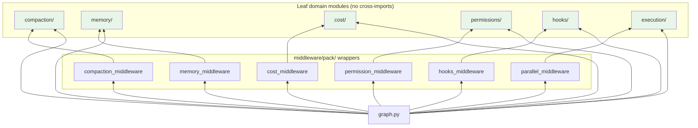

# Domain dependency rules

Rules governing import directions between modules in `libs/deepagents/deepagents/`. These exist to keep domain modules as independent, testable leaf nodes and to prevent circular dependencies.

---

## Rule 1: Domain modules must not import from each other

The six domain modules are:

- `compaction/`
- `memory/`
- `cost/`
- `permissions/`
- `hooks/`
- `execution/`

Each module is self-contained. No domain module may import from any other domain module. If two domain modules need to interact, that interaction is wired in `graph.py` or in a `middleware/pack/` wrapper.

## Rule 2: Domain modules must not import from `middleware/`

Domain modules contain pure logic. They must not depend on the middleware layer. The dependency direction is always `middleware -> domain`, never the reverse.

## Rule 3: `middleware/pack/` wrappers import only their corresponding domain module

Each Pack wrapper in `middleware/pack/` bridges exactly one domain module into the middleware contract:

| Wrapper | Imports |
|---------|---------|
| `cost_middleware.py` | `cost/` |
| `permission_middleware.py` | `permissions/` |
| `compaction_middleware.py` | `compaction/` |
| `memory_middleware.py` | `memory/` |
| `hooks_middleware.py` | `hooks/` |
| `parallel_middleware.py` | `execution/` |

A Pack wrapper must not import from another domain module or from another Pack wrapper. Cross-cutting concerns are composed in `graph.py`.

## Rule 4: `providers/` must not import from `middleware/`

Provider modules (`OpenRouterProvider`, `OllamaProvider`, etc.) are model-routing abstractions. They produce `BaseChatModel` instances. They must not depend on middleware.

## Rule 5: `prompt/` must not import from `middleware/`

The prompt builder assembles system prompt text from modular sections. It must not depend on middleware internals. Middleware may depend on prompt output, but not the reverse.

## Rule 6: `graph.py` is the only file that may import everything

`graph.py` is the assembly root. It is the only module permitted to import from all layers: domain modules, middleware, middleware/pack wrappers, backends, profiles, providers, prompt, and tools. It wires everything together into a `CompiledStateGraph`.

No other module should have imports spanning more than two layers.

---

## The two permission systems

Pack has two distinct permission systems that operate at different levels.

### SDK-level: `_PermissionMiddleware`

**Location:** `deepagents/middleware/permissions.py`

**Purpose:** Filesystem path-based permission enforcement. This is the canonical permission system for the upstream SDK contract.

**How it works:**
- Accepts a list of `FilesystemPermission` rules (glob patterns with allow/deny).
- Intercepts tool calls via `wrap_tool_call` / `awrap_tool_call`.
- **Pre-check:** For filesystem tools (`write_file`, `edit_file`, `execute`, etc.), evaluates rules against the path extracted from tool args. First matching rule wins; no match means allow.
- **Post-filter:** For tools whose output carries structured path data (`ls`, `glob`, `grep`), denied paths are filtered from the result.
- Always placed **last** in the middleware stack so it sees all tools injected by prior middleware.

**Scope:** Applies to both the main agent and subagents (subagents inherit parent rules unless they declare their own `permissions` field).

### Pack-level: `PermissionMiddleware`

**Location:** `deepagents/middleware/pack/permission_middleware.py`

**Purpose:** Tool call authorization through a multi-layer permission pipeline. Wraps domain logic from `deepagents/permissions/`.

**How it works:** The pipeline (`deepagents/permissions/pipeline.py`) processes tool calls through 4 layers with a circuit breaker:

| Layer | Name | Behavior |
|-------|------|----------|
| 0 | **Circuit breaker** | If tripped (too many denials), forces all calls to manual mode. |
| 1 | **Rule matching** | Checks persisted cross-session rules (`RuleStore`). First match wins (allow or deny). |
| 2 | **Risk assessment** | Static risk classification per tool name (read/write/execute/destructive). Read-only tools auto-approve. |
| 3 | **Read-only whitelist** | Explicit whitelist for known safe tools. Catches tools not in the risk map. |
| 4 | **Classifier** | Deterministic regex patterns first, optional LLM fallback. Returns allow, hard-deny, or soft-deny (ask user). |

**Learning:** When a user approves or denies a call, `learn_from_user()` can persist the decision as a cross-session rule for Layer 1.

**Relationship between the two systems:**
- SDK-level `_PermissionMiddleware` is the canonical contract for SDK consumers. It enforces file-path access rules.
- Pack-level `PermissionMiddleware` is the operational authorization layer for the CLI experience. It decides whether a tool call should proceed, be denied, or require user confirmation.
- Both are composed in `graph.py`. Pack's middleware appears earlier in the stack (position ~11); SDK's appears last (position 19). A tool call must pass both.

---

## System prompt codepath split

### CLI: `SystemPromptBuilder`

When `PACK_ENABLED=1`, `graph.py` uses `deepagents.prompt.builder.SystemPromptBuilder` to assemble the system prompt from modular sections:

- `identity_section` -- agent name and capabilities
- `environment_section` -- OS, shell, working directory
- `git_section` -- repository context
- `safety_section` -- behavioral guardrails
- `style_section` -- output formatting rules
- `tool_rules_section` -- tool-specific usage guidance

The builder applies provider-aware cache control boundaries (`AnthropicCacheStrategy`, `OpenAICacheStrategy`) to split the prompt into static (cacheable) and dynamic (per-session) segments.

When `PACK_ENABLED` is not set, `graph.py` falls back to `BASE_AGENT_PROMPT` (a constant in `graph.py`) optionally modified by `_HarnessProfile.base_system_prompt` and `system_prompt_suffix`.

### Harbor: separate context constant

`libs/evals/deepagents_harbor/deepagents_wrapper.py` builds a benchmark-specific preamble via `_get_formatted_system_prompt()`. This includes:

- Working directory listing from the sandbox
- Current directory path
- Benchmark context and environment details

This string is passed as `system_prompt` to either `create_cli_agent` (Pack mode, which layers it under `SystemPromptBuilder`) or `create_deep_agent` (SDK mode, which concatenates it with `BASE_AGENT_PROMPT`).

The split exists because CLI needs rich, cacheable prompt sections for interactive use, while Harbor needs minimal benchmark context for reproducible evaluation runs.

---

## Dependency direction diagram

Arrows point in the allowed import direction (importer -> imported). Green nodes are leaf modules that must not have outgoing edges to siblings.
